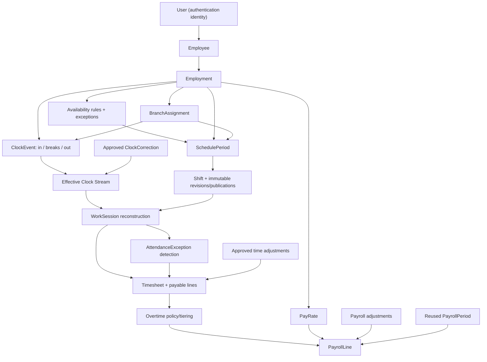
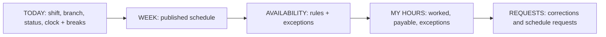
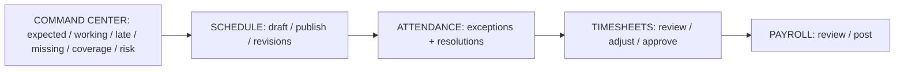

# Workforce V1 — Target runtime architecture

## Single-source flow

Only the models shown on this path are authoritative in V1 mode. User authenticates but does not own employment status, branch assignment or compensation. Payroll never reads raw ClockEvent, legacy TimeClockEntry or Shift directly; it consumes an approved Timesheet.

## Domain boundaries

| Boundary | Owns | Does not own |
|---|---|---|
| Identity | User login, role and permissions | Employment facts or pay |
| Employment | Employee, active Employment, assignments and rates | Authentication credentials |
| Availability | Recurring rules and dated exceptions | Published schedule state |
| Scheduling | Drafts, canonical Shift, revisions and publication evidence | Attendance outcome |
| Clock | Immutable observed events and correction decisions | Worked/payable totals |
| Reconstruction | Effective stream and WorkSession | Approval/pay policy |
| Attendance | Detected exceptions and resolution | Shift mutation |
| Timesheet | Worked, adjusted and approved payable minutes | Monetary snapshots |
| Payroll | Explicit rate/currency and approved-time snapshots | Reconstructing raw time |

## Runtime services

- `employment`: resolve exactly one active Employment; validate branch assignment and PayRate invariants.
- `availability`: query/update native rules and exceptions; expose schedule constraint evaluation.
- `schedule`: commands for draft/update/cancel/publish and immutable revision snapshots.
- `clock`: append idempotent ClockEvents and ClockCorrections from authorized server context.
- `effective-stream`: pure ordering/correction reducer.
- `sessions`: deterministic reconstruction with versioned policy.
- `attendance`: exception detectors (late, early, missing, no-show, unscheduled, overtime, break anomaly).
- `timesheets`: period lines, WorkSession links, adjustments, review and approval.
- `payroll`: consume approved Timesheet and snapshot PayRate/currency/multipliers/adjustments into PayrollLine.

No service imports legacy Workforce models after cutover.

## Employee experience

Employee reads are scoped by the authenticated User's active Employment. The server derives branch and employee identity; clients submit only command facts they are allowed to choose.

## Manager experience

The command center is a projection of Shift, WorkSession and open AttendanceException; it is not a new source of truth.

## Isolated route topology during DEV

| Experience | Temporary DEV route | Final replacement |
|---|---|---|
| Employee today | `/workforce-v1` | `/timeclock` |
| Week | `/workforce-v1/week` | `/timeclock/calendar` |
| Availability | `/workforce-v1/availability` | `/timeclock/availability` |
| Hours | `/workforce-v1/hours` | `/timeclock/hours` |
| Requests | `/workforce-v1/requests` | `/timeclock/requests` |
| Manager command | `/administration/workforce-v1` | personnel timeclock/dashboard entry |
| Schedule | `/administration/workforce-v1/schedule` | `/administration/schedule` |
| Attendance | `/administration/workforce-v1/attendance` | new final route |
| Timesheets | `/administration/workforce-v1/timesheets` | new final route |
| Payroll | `/administration/workforce-v1/payroll` | `/timeclock/payroll` |

`WORKFORCE_V1_ENABLED` controls access/navigation in DEV only. OFF means legacy routes and legacy source exclusively; ON exposes isolated V1 routes and V1 source exclusively. It is not a dual-write switch.

## Cutover shape

Complete/test vertical slices in isolated routes, freeze the selected DEV QA dataset, replace route/action imports in one rollback-capable commit, and verify no runtime legacy queries. Only then delete legacy UI/actions and dependent models, followed by a separately reviewed destructive migration. Git is code rollback; the DEV restore point is data rollback.
